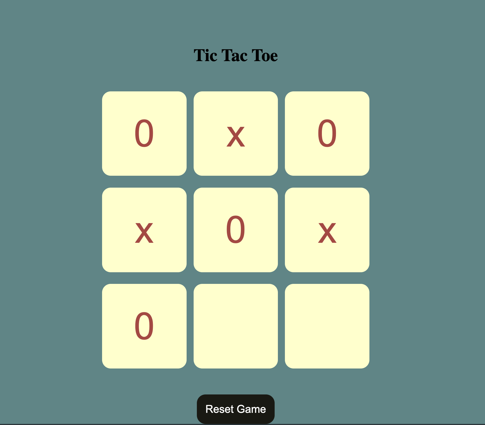
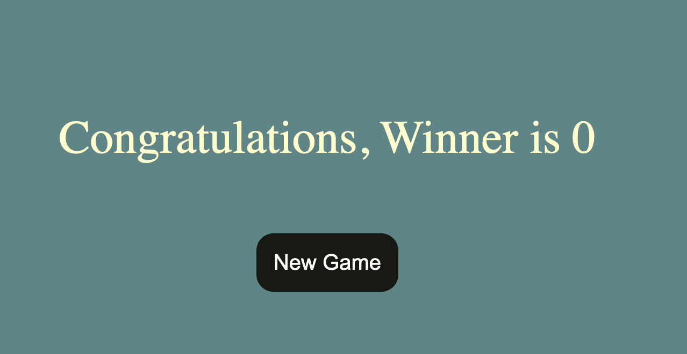

# 🎮 Tic Tac Toe Game

A simple and interactive **Tic Tac Toe game** built using **HTML, CSS, and JavaScript**.
Play with your friend and enjoy this classic game in your browser!

---

## 🚀 Live Demo
 https://solanki-tarun.github.io/tic-tac-toe-game/

---

## 🛠️ Technologies Used

* HTML5
* CSS3
* JavaScript (Vanilla JS)

---

## 🎯 Features

* 🧑‍🤝‍🧑 2 Player Game (X vs O)
* 🎨 Clean and responsive UI
* 🧠 Win detection logic
* 🔄 Reset / Restart game option
* ⚡ Fast and lightweight

---

## 📂 Project Structure

```
tic-tac-toe-game/
│── index.html
│── style.css
│── script.js
```

---

## 🧠 How the Game Works

* The game is played on a **3×3 grid**
* Player 1 uses **X** and Player 2 uses **O**
* Players take turns to mark a box
* First player to get **3 in a row (horizontal, vertical, diagonal)** wins
* If all boxes are filled and no winner → it's a **Draw**

---


## 📸 Screenshot


---



## 💡 Future Improvements

* 🤖 Add AI (Play vs Computer)
* 🌐 Online multiplayer
* 🔊 Sound effects
* 📱 Mobile app version

---

## 👨‍💻 Author

**Tarun Solanki**

* GitHub: https://github.com/yourusername

---

## ⭐ Support

If you like this project, please **star ⭐ the repository** and share it!

---
